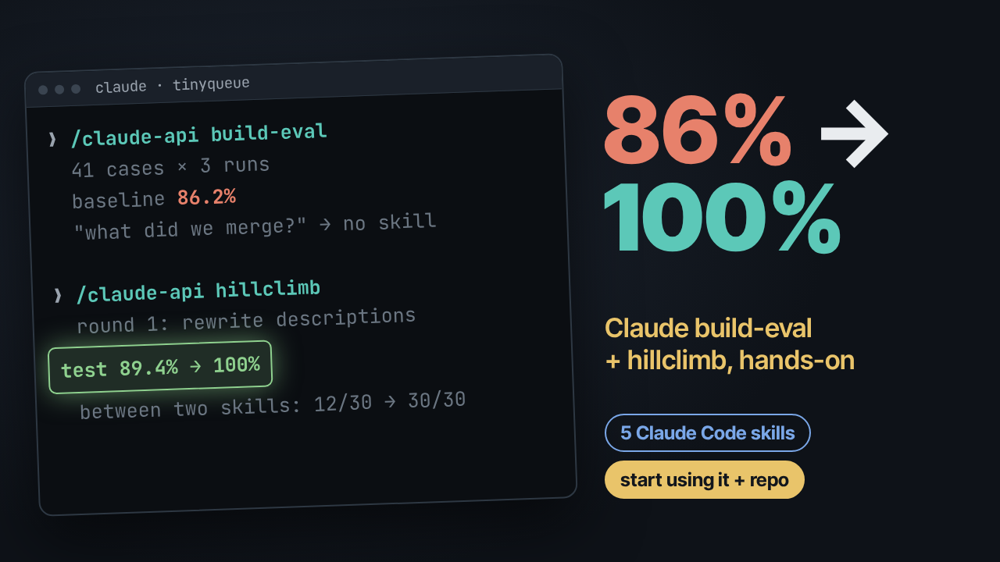

# Claude build-eval and hillclimb - Start Using it

[](https://youtu.be/VIDEO_ID)

**Video:** https://youtu.be/VIDEO_ID

This repo has everything from the video: five Claude Code skills whose jobs overlap, the routing eval that `/claude-api build-eval` built for them, and the one round of `/claude-api hillclimb` that took routing from **86.2% to 100%**.

`tinyqueue` is a tiny sample Python library. The interesting parts are the skills in `.claude/skills/` and the eval in `scripts/` and `.claude/hillclimb/skill-routing/`.

## Results

All numbers are for Sonnet at low effort, with 3 runs per case.

| Case set | Original descriptions | After round one |
|---|---|---|
| 41 cases (train 19 / test 22) | 86.2% (106/123) | 100% (123/123) |
| test cases only (never shown to hillclimb) | 89.4% | 100% |
| + 12 look-alikes (53 cases) | 85.5% | 100% (159/159) |
| + 10 between-two-skills cases (63 cases) | 78.3% | 100% (189/189) |
| between-two-skills cases alone | 40% (12/30) | 100% (30/30) |

Every miss was the same shape: Claude ran `git` itself instead of using the skill. Neither version ever picked the wrong skill. The SDK-reported cost was $0.0183 per run before and $0.0176 after.

## What's in here

```
.claude/skills/<5 skills>/SKILL.md            the skills, after round one
.claude/hillclimb/skill-routing/
    cases.jsonl, cases.md                     63 cases: 7 real, 34 synthetic, 12 look-alikes, 10 between-two-skills
    baseline/skills/                          the original 3-word descriptions
    baseline/results.jsonl                    189 scored runs, original descriptions
    v1/skills/, v1/change.md, v1/change.patch round one: what changed and why
    v1/results.jsonl                          189 scored runs, after round one
    narrative.md                              the round-by-round log
scripts/which_skill.py                        one request in, the first skill Claude picks out
scripts/eval_skill_routing.py                 the runner and grader that build-eval wrote
```

Git tags mark each stage: `before` (original skills, no eval), `baseline` (eval plus the first score), `round-1`, `look-alikes` and `between-two`.

## Quick start

You need Python 3.10 or newer and Claude Code (2.1.293 or newer) installed and logged in. The scripts use your Claude Code login through the Claude Agent SDK, so you don't need an API key. Each routing check is one model turn, and the SDK reports about $0.02 per check. Every output below comes from a fresh clone. Model answers can vary from run to run.

### 1. Clone and install

```bash
git clone https://github.com/schoolofai/claude-skill-routing-eval
cd claude-skill-routing-eval
python3 -m venv .venv
.venv/bin/pip install -r requirements.txt
```

`requirements.txt` pins a single package, `claude-agent-sdk==0.2.164`.

### 2. Ask which skill fires ([video 2:07](https://youtu.be/VIDEO_ID?t=127))

`scripts/which_skill.py` sends one request and reports the first skill Claude picks. It allows one model turn, and every tool except Skill is denied, so nothing runs:

```python
opts = ClaudeAgentOptions(
    cwd=str(REPO), model=model, effort=effort,
    max_turns=1,                      # one model turn: we only want its first move
    skills="all",                     # every skill in .claude/skills is listed, like a normal session
    setting_sources=["project"],
    hooks={"PreToolUse": [HookMatcher(matcher=None, hooks=[_deny_all_but_skill])]},
)
```

```bash
.venv/bin/python scripts/which_skill.py "Fill in the PR body for this branch."
.venv/bin/python scripts/which_skill.py "What did we merge this week? Just a quick list for standup."
```

```
{"skill": "pr-description", "first_tool": "Skill", "model": "claude-sonnet-5-5", "cost_usd": 0.0237532, "latency_s": 4.8}
{"skill": "weekly-update", "first_tool": "Skill", "model": "claude-sonnet-5-5", "cost_usd": 0.0237892, "latency_s": 3.21}
```

These are the round-one descriptions, so both requests reach the right skill.

### 3. Put the original descriptions back and watch it miss ([video 2:35](https://youtu.be/VIDEO_ID?t=155))

The original descriptions are saved in `.claude/hillclimb/skill-routing/baseline/skills/`. Here is one of them:

```markdown
---
name: weekly-update
description: Summarizes recent work.
---
```

```bash
cp -r .claude/hillclimb/skill-routing/baseline/skills/. .claude/skills/
.venv/bin/python scripts/which_skill.py "What did we merge this week? Just a quick list for standup."
```

```
{"skill": null, "first_tool": "Bash", "model": "claude-sonnet-5-5", "cost_usd": 0.0229632, "latency_s": 3.85}
```

No skill fired, and Claude's first move was a shell command. That is the bug the whole video measures.

### 4. Check the grader before trusting it ([video 5:24](https://youtu.be/VIDEO_ID?t=324))

The grader is plain code with an exact match and no judge model (`scripts/eval_skill_routing.py`):

```python
def grade(expected: str, skill):
    """Exact match on the first Skill call. A first move that is not a Skill call (Bash, text only) is a miss."""
    if expected == "none":
        ok = skill not in SKILLS      # no Skill call, or a skill outside our five (e.g. built-in code-review): neither is our routing
        return {"correct": float(ok), "specificity": float(ok)}
    ok = skill == expected
    return {"correct": float(ok), "recall": float(ok)}
```

`--selftest` makes no model calls. It scores fake answers that should get known results, and checks that errors and timeouts are never scored as misses:

```bash
.venv/bin/python scripts/eval_skill_routing.py --selftest
```

```
oracle/null on 63 cases
  oracle (expected label as the answer)   100.0%  (want 100%)
  null: never invokes a skill              39.7%  (= share of 'none' cases)
  null: always 'release-notes'             12.7%
  null: always 'changelog'                 11.1%
  induced api error    -> errors.jsonl x3 [harness_error], results.jsonl written: False  OK
  induced hang         -> errors.jsonl x1 [timeout], results.jsonl written: False  OK
  induced wrong model  -> errors.jsonl x3 [model_mismatch], results.jsonl written: False  OK
  induced zero usage   -> errors.jsonl x3 [incomplete_row], results.jsonl written: False  OK
  well-formed attempt -> row + trace written  OK
```

### 5. Approve the harness and run a pilot ([video 6:17](https://youtu.be/VIDEO_ID?t=377))

The runner won't run until you approve it. `--approve-harness` records a hash of the runner, `which_skill.py`, `requirements.txt` and `cases.jsonl`. If any of them changes, you have to approve again. The original descriptions from step 3 are still in place:

```bash
.venv/bin/python scripts/eval_skill_routing.py --approve-harness
.venv/bin/python scripts/eval_skill_routing.py --variant my-try --ids c04,c05,c20 --reps 1
```

```
harness approved: 746198fc100a
3 runs to do (0 already done) on model=sonnet effort=low
  1/3 done, 4s
  2/3 done, 4s
  3/3 done, 9s
correct 33.3% +/- 65.3% (95% CI over 3 cases, 3 scored runs); errors: 0 failed attempts {}
skill             recall  precision
announce            nan%       nan%
changelog           100%       100%
pr-description        0%       nan%
release-notes       nan%       nan%
weekly-update         0%       nan%
confusion (expected -> picked):
  pr-description  -> (none)          x1
  weekly-update   -> (none)          x1
miss classes: {'no_skill:first_tool=Bash': 2}
latency_s median 4.5 (max 8.5); sdk cost/run $0.0176 (total $0.053)
```

Leave out `--ids` and `--reps` to run every case 3 times. That is 189 runs on 63 cases, about $3.50 as reported by the SDK. Results go to `.claude/hillclimb/skill-routing/<variant>/`.

### 6. Read the scores from the video ([video 7:05](https://youtu.be/VIDEO_ID?t=425))

Both full runs are saved, so `--summary` can recompute them without any model calls:

```bash
.venv/bin/python scripts/eval_skill_routing.py --summary                 # original descriptions
.venv/bin/python scripts/eval_skill_routing.py --summary --variant v1    # after round one
```

```
correct 78.3% +/- 9.9% (95% CI over 63 cases, 189 scored runs); errors: 0 failed attempts {}
skill             recall  precision
announce             57%       100%
changelog            86%       100%
pr-description       50%       100%
release-notes        67%       100%
weekly-update        62%       100%
none (specif.)      100%
confusion (expected -> picked):
  announce        -> (none)          x9
  changelog       -> (none)          x3
  none            -> code-review     x3
  pr-description  -> (none)          x12
  release-notes   -> (none)          x8
  weekly-update   -> (none)          x9
miss classes: {'no_skill:first_tool=Bash': 38, 'no_skill:first_tool=text_only': 3}
latency_s median 4.1 (max 17.1); sdk cost/run $0.0183 (total $3.451)

correct 100.0% +/- 0.0% (95% CI over 63 cases, 189 scored runs); errors: 0 failed attempts {}
skill             recall  precision
announce            100%       100%
changelog           100%       100%
pr-description      100%       100%
release-notes       100%       100%
weekly-update       100%       100%
none (specif.)      100%
confusion (expected -> picked):
  none            -> code-review     x3
miss classes: {}
latency_s median 3.4 (max 15.4); sdk cost/run $0.0179 (total $3.386)
```

The `none -> code-review` line is the bundled code-review skill answering "Review my PR for bugs and style problems." The grader counts a skill outside our five as "none". That grading rule was changed on camera, before any tuning.

### 7. See what hillclimb changed ([video 9:43](https://youtu.be/VIDEO_ID?t=583))

`.claude/hillclimb/skill-routing/v1/change.md` explains the change:

```
Analyzer finding (train only): all misses are Bash-first on indirect phrasings of git-history summarization (c04, c06 3/3; c11, c15 2/3). Terse descriptions don't say the skill reads git itself. Change: each description states deliverable, audience, indirect shapes, "use this first, before running git", plus "Not for" boundaries to protect 'none' cases (review/merge PR).
```

```bash
git checkout -- .claude/skills                 # back to the round-one descriptions
git diff before round-1 -- .claude/skills/pr-description/SKILL.md
```

```diff
diff --git a/.claude/skills/pr-description/SKILL.md b/.claude/skills/pr-description/SKILL.md
index f8f598d..4405708 100644
--- a/.claude/skills/pr-description/SKILL.md
+++ b/.claude/skills/pr-description/SKILL.md
@@ -1,6 +1,6 @@
 ---
 name: pr-description
-description: Writes PR descriptions.
+description: "Writes the pull request body for the current branch (what changed, why, testing, where the reviewer should look first), including requests to summarize a branch for a reviewer. Use this first, before running git commands; it reads the diff itself. Not for reviewing a PR, merging, or code changes."
 ---
 
 # Pull request description
```

The other four descriptions follow the same pattern. The harder case sets are in the `look-alikes` and `between-two` tags ([video 10:58](https://youtu.be/VIDEO_ID?t=658)).

### 8. Run it on your own skills ([video 14:39](https://youtu.be/VIDEO_ID?t=879))

In your own repo, inside Claude Code:

```
claude update
/claude-api build-eval
/claude-api hillclimb
```

- `build-eval` asks you questions, drafts cases around 5 to 10 real requests that went wrong, and writes a runner and grader. It stops for you to approve the harness ([video 2:49](https://youtu.be/VIDEO_ID?t=169)).
- `hillclimb` asks for a goal, the scope it may change and a held-out split, then runs one round at a time ([video 8:24](https://youtu.be/VIDEO_ID?t=504)).
- When you hit 100%, make the eval harder before you believe it.

## Limits

These results cover one model (Sonnet) at one effort setting (low) and single-message requests. Most cases are synthetic or were written after the fact. A 100% score on 63 cases only rules out a failure rate above about 5%. The eval checks which skill fires, not how good the skill's output is.

## Sources

- Anthropic, "Automating eval design and hillclimbing with Claude": https://claude.dev/blog/automating-eval-design-and-hillclimbing/
- The explainer video, Evals Explained Step by Step: https://youtu.be/V4RDdbEljo8

## Licence

MIT. See [LICENSE](LICENSE).
